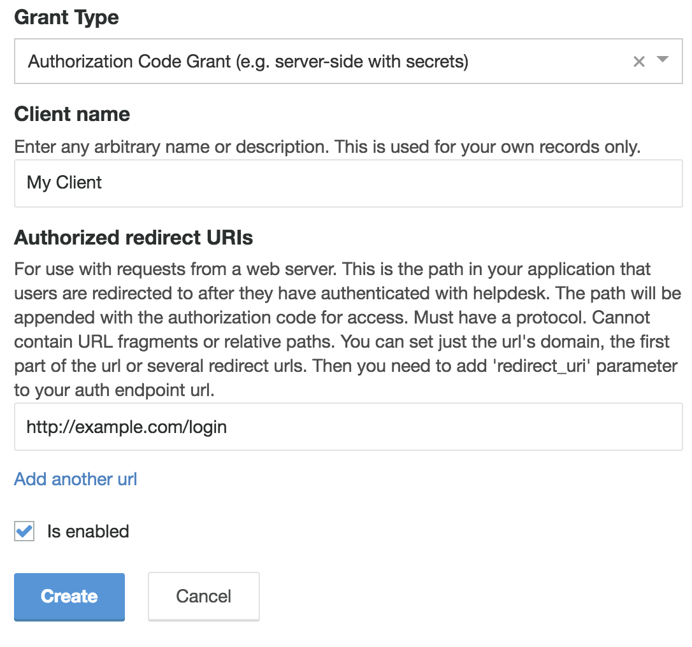
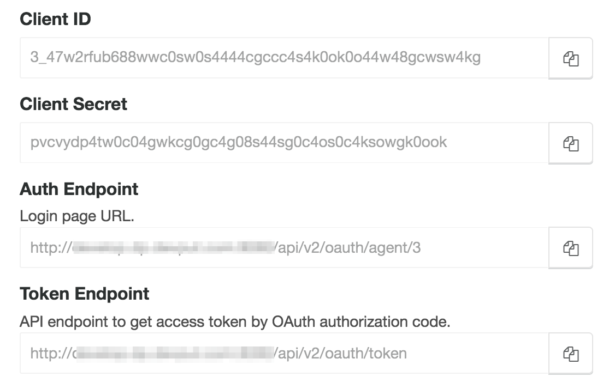
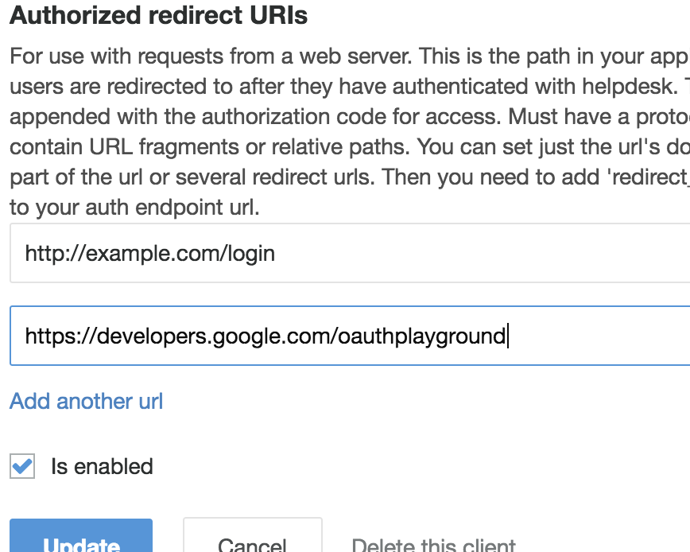
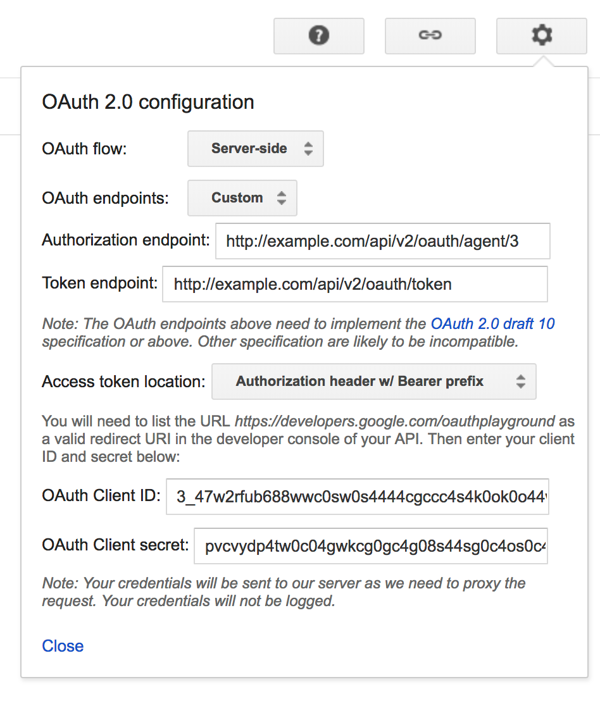

# OAuth

## OAuth

OAuth is the best way to have your app authenticate a user against Deskpro. OAuth in Deskpro yields an [API Token](https://github.com/deskpro/dev-guide/tree/ac4872079948383c56c00688a724e166df9bdbbc/api-basics/api-keys/api-tokens.md) that you can store and use to authorize API requests on behalf of the user.

Note: Deskpro uses _OAuth2_. The original OAuth protocol \(OAuth1a\) is outdated and no longer supported by most systems. If you are using third-party libraries to help you implement the OAuth workflow, be sure the libraries are speaking OAuth2. OAuth1a and OAuth2 are complete different protocols and are not at all compatible.

**Useful reading**

OAuth is a big subject. There are many tools and libraries available to make it easy to use, but it's often helpful to understand the basics.

* Introduction to OAuth -- [https://oauth.net/about/introduction/](https://oauth.net/about/introduction/)
* OAuth 2 Simplified -- [https://aaronparecki.com/oauth-2-simplified/](https://aaronparecki.com/oauth-2-simplified/)
* Guide to OAuth2 Grants -- [https://alexbilbie.com/guide-to-oauth-2-grants/](https://alexbilbie.com/guide-to-oauth-2-grants/)

### Creating an OAuth Client

To use OAuth, you first need to create a _client_. An OAuth client is the "thing" that will be using OAuth to authenticate users -- so it's your app. You'll typically create one OAuth client per app you write.

You create clients from within Deskpro itself. Go to _Admin -&gt; Apps -&gt; OAuth_ and click the add button.

#### Grant Types

OAuth provides multiple methods of operation. These are referred to as _grant types_. Deskpro supports two grant types. The one you use will depend on your use-case:

* Authorization Code Grant: Use this if you're using a server-side based script. This method includes the use of secrets \(which remain server-side\) and therefore it's only suitable when the OAuth flow happens entirely server-side.
* Implicit Grant: Use this if you do not control the environment where you plan to use OAuth. This includes things like mobile apps or Javascript-only apps with no server-side component. With an implicit grant, the flow happens entirely client-side.

#### Client Details \(client ID, client secret, auth endpoint, token endpoint\)

After you create an OAuth client, click the gear to view the details of the client. This will show you all of the information you need to set up an OAuth flow.

## Testing with OAuth Playground

The easiest way to validate OAuth is working properly is to use [Google's OAuth Playground](https://developers.google.com/oauthplayground/).

First, in Deskpro, you need to add `https://developers.google.com/oauthplayground` as a valid redirect URL. Edit your OAuth client to add the URL.

1. Click the gear at the top right of the screen
2. Select the appropriate _OAuth flow_. Select "Server-side" for Authorization Code grant, or "Client-side" for Implicit grant.
3. You must change the _OAuth endpoints_ option to "Custom".
4. Fill in the _Auth endpoint_, _token endpoint_, _client id_, and _client secret_ with the values you get from Deskpro \(_client secret_ will only apply for Server-side flows\).
5. Click the "Close" button.

Then to begin the auth workflow:

1. On the right, in the box titled _Step 1: Select & authorize APIs_, at the bottom of the list is an input box. Enter `Basic` into the box then click the _Authorize APIs_ button.
2. This will start the OAuth2 flow. Log in as usual.
3. After logging in and accepting, you _should_ be redirected back to Google. If you have been redirected back successfully, it means everything worked.

